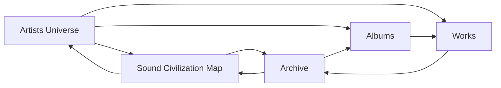

# Navigation Graph

## Purpose

This document defines the required navigation logic between Artists Universe, Sound Civilization Map, Works, Albums, and Archive.

This is a structural navigation document, not a UI layout document.

## Primary Rule

Music Factory must not contain isolated page structures.

Every page must participate in a world route.

## Required User Paths

### Path A - Artist to Map to Archive

Artist -> Sound Map -> Archive

Meaning:

1. The visitor enters through an artist universe.
2. The artist reveals its position inside the larger Sound Civilization Map.
3. The map leads toward archive memory.

Use when the visitor begins with a specific artist.

### Path B - Map to Artist to Works to Archive

Sound Map -> Artist -> Works -> Archive

Meaning:

1. The visitor enters the cultural atlas.
2. The atlas opens an artist civilization.
3. The artist leads into works as civilization chapters.
4. Works lead into Archive as memory evidence.

Use when the visitor begins with the world system.

## Secondary User Paths

### Album Route

Artist -> Album -> Works -> Archive

Album routes must always preserve artist and realm ownership.

### Archive Return Route

Archive -> Sound Map -> Artist

Archive must never become a terminal storage area.

It must offer return paths into world and voice.

### Work Context Route

Work -> Artist -> Sound Map

Works must not be isolated song objects.

They must point back to artist identity and civilization context.

## Navigation Graph

## Node Definitions

### Artists Universe

The origin node.

Defines artist identity, worldview, voice logic, visual language, and ownership.

Required outgoing links:

- Sound Civilization Map.
- Works.
- Albums when available.
- Archive.

Required incoming links:

- Sound Civilization Map.
- Works.
- Archive.

### Sound Civilization Map

The atlas node.

Defines the cultural relationship between artist civilizations.

Required outgoing links:

- Artist universe.
- Archive route.
- Future artist expansion route.

Required incoming links:

- Homepage.
- Artist universe.
- Archive.

### Works

The chapter node.

Defines the individual sound chapters inside a civilization.

Required outgoing links:

- Artist universe.
- Album when applicable.
- Archive.

Required incoming links:

- Artist universe.
- Album.
- Sound Map route when featured.

### Albums

The collection node.

Defines a group of works as a coherent civilization chapter.

Required outgoing links:

- Works.
- Archive.
- Artist universe.

Required incoming links:

- Artist universe.
- Archive.
- Works.

### Archive

The memory node.

Defines preserved evidence, versions, years, types, and cultural context.

Required outgoing links:

- Sound Civilization Map.
- Artist universe.
- Album.
- Work.

Required incoming links:

- Sound Civilization Map.
- Artist universe.
- Album.
- Work.

## Forbidden Navigation Patterns

- Homepage -> Archive with no world context.
- Artist -> external dead end.
- Work -> player-only behavior.
- Album -> isolated release page.
- Archive -> terminal list.
- Sound Map -> decorative page with no artist or archive routes.

## Route Labels

Navigation labels should describe cultural movement, not technical action.

Preferred labels:

- Back to Civilization.
- Enter World.
- Explore Map.
- View Archive.
- Follow the Work when the route enters a specific work chapter.
- Open Album Memory when the route enters an album as a memory collection.

Avoid labels that reduce the system to utility:

- View details.
- Open data.
- Filter.
- Manage.
- Dashboard.
- Player only.

## Milestone 15.6 Label Rule

Product-level navigation must use the four unified labels:

- Back to Civilization.
- Enter World.
- Explore Map.
- View Archive.

Older labels such as Enter Artist Universe, Return to Sound Map, and Enter Archive should be mapped to the unified labels during future UI passes.

## Agent Rule

Before creating or changing a page, identify:

1. Its upstream source.
2. Its downstream destination.
3. Its return route.
4. Its Knowledge Base source.

If any of these are missing, the page structure is incomplete.
